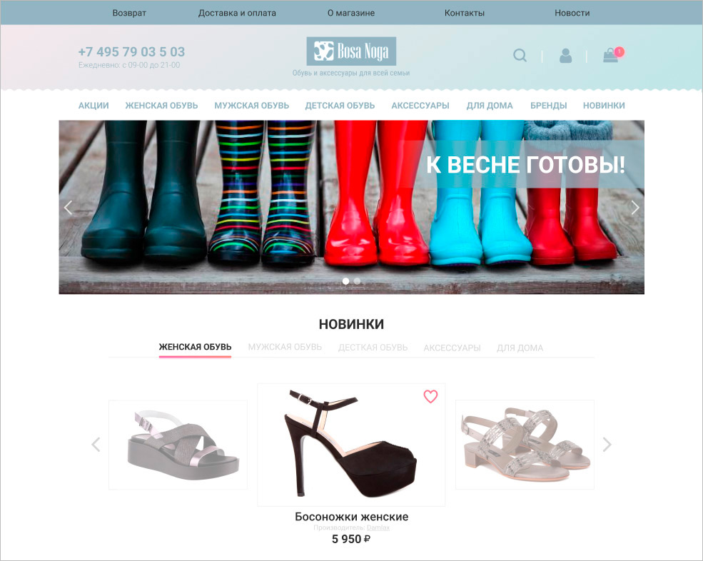

# Дипломный проект курса «Библиотека React»

Дипломный проект представляет собой интернет-магазин обуви. Задача заключалась в создании работающего приложения, всеми основными функциями которого можно пользоваться.

## Содержание

Приложение содержит следующие самостоятельные экраны (страницы):

+ Главная страница;
+ Каталог товаров;
+ Избранное;
+ Страница товара;
+ Оформление заказа.

И встроенные (являющиеся частью самостоятельных) экраны:
+ Товар;
+ Корзина покупок;
+ Поиск;
+ Подписка.

